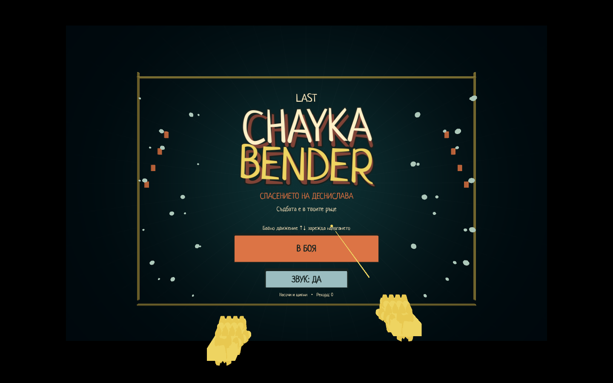
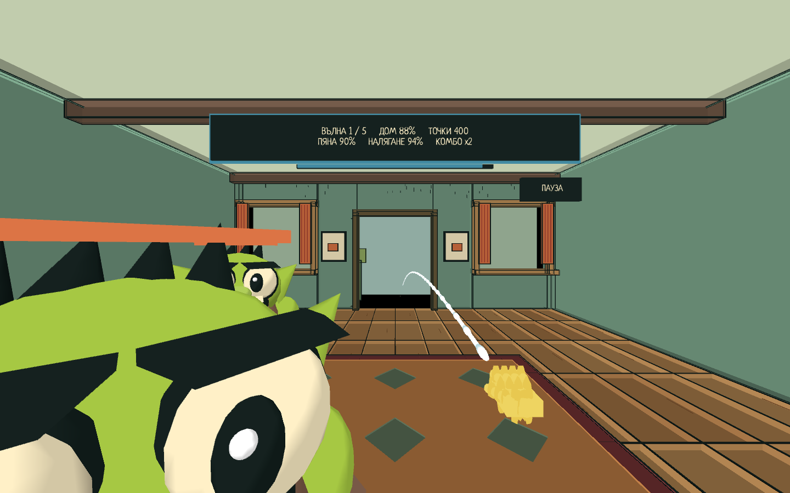

# Last Chayka Bender

**Спасението на Деснислава — „Съдбата е в твоите ръце“**

Hand-tracking arcade wave game за **Meta Quest Pro**, направена с **Godot 4.7.2**. Защитаваш къща от комични 3D нашественици със сапунена струя от дясната ръка. Без контролери.

**Fork-вай, променяй и създай собствена версия.** Авторският код и собствените assets са под [MIT лиценз](LICENSE); външните компоненти запазват [своите лицензи](THIRD_PARTY.md).



## Играй

Изтегли APK от [Releases](https://github.com/peshigoshi27/last-chayka-bender/releases). Това е **debug прототип 0.2.2**, не Store издание. Проектът е изпитван на Quest Pro; пълното физическо приемане на последната ревизия още предстои.

Инсталирай със SideQuest или ADB, включи hand tracking и остави контролерите. Заглавието се появява автоматично. Насочи ръка към **„В БОЯ“** и щипни.

- Помпай с десния юмрук нагоре–надолу. Един пълен цикъл брои веднъж.
- Няма стрелба само от затваряне на ръката. Първите цикли дават слаб поток; след поне **10 помпания** струята става плътна.
- Налягането определя обсега; гравитацията извива струята надолу.
- Отворена лява длан: щит. Плясък: взрив. Среден пръст: повече пяна, но по-ядосани врагове.
- Пауза: насочи към бутона горе вдясно за 0.75 s, после щипни.

Една къща, пет вълни, три вида 3D врагове, бос, резултат и рестарт. [Подробно управление](docs/GAMEPLAY.bg.md).



## Направи своя версия

1. Натисни **Fork** горе вдясно в GitHub и клонирай своя fork.
2. Инсталирай [Godot 4.7.2](https://github.com/godotengine/godot/releases/tag/4.7.2-stable) и Python 3.9+.
3. В папката на проекта изпълни:

```sh
python3 tools/project.py setup
```

Това изтегля **OpenXR Vendors 5.1.0** от официалния release и проверява SHA256 от `dependencies.json`. Зависимостите и кешовете не са част от Git историята.

Отвори `project.godot` в Godot. За команди от терминала сложи Godot в `PATH` или задай `GODOT` към изпълнимия файл:

```sh
export GODOT="/path/to/Godot"
python3 tools/project.py test
python3 tools/project.py preview
```

На Windows използвай `python` вместо `python3` и `$env:GODOT="C:\path\Godot.exe"` в PowerShell. Desktop preview е автоматична демонстрация. Реалната игра чете проследените ръце на Quest.

## Построй APK

- Инсталирай Godot export templates за **4.7.2**, JDK 17 и Android SDK с platform/build tools.
- В **Editor Settings → Export → Android** задай пътищата към Java SDK и Android SDK.
- Задай `JAVA_HOME` и `ANDROID_HOME` за терминала. Ако `aapt` не се открива автоматично, задай `AAPT` към неговия изпълним файл.

```sh
python3 tools/project.py build
python3 tools/project.py install
```

Build първо изпълнява тестовете, подготвя Android template от инсталираните Godot export templates, експортира и проверява APK. Ако template липсва, инсталирай го чрез **Project → Install Android Build Template**. Резултатът е `build/LastChaykaBender-Quest.apk`.

`install` използва ADB от `PATH`/Android SDK или променливата `ADB`. При няколко устройства задай `ANDROID_SERIAL`. На macOS има `BUILD.command`, `INSTALL.command`, `PREVIEW.command` за двоен клик.

За собствено приложение смени **`package/unique_name`** и **`package/name`** в `export_presets.cfg`, например `org.yourname.foamdefender`. Така твоята версия може да живее до оригинала. Използвай собствен signing key за разпространявани builds; ключовете не се качват в Git.

## Къде се променя играта

| Файл | Какво управлява |
|---|---|
| `scripts/rules.gd` | Вълни, баланс, налягане, щети и балистика |
| `scripts/gestures.gd` | Разпознаване и броене на движенията |
| `scripts/main.gd` | Екрани, игрови цикъл и рендер на струята |
| `scripts/enemy_model.gd` | Обемни врагове и анимации |
| `scripts/art.gd` | Къща и визуални помощни функции |
| `scripts/title_screen.gd` | Анимирано заглавие |
| `scripts/hands.gd` | OpenXR hand tracking |
| `scripts/sound.gd` | Процедурни звуци |

## Промени и проверки

[CONTRIBUTING.md](CONTRIBUTING.md) описва fork → branch → промени → Pull Request. Можеш да публикуваш отделна версия в собствения си fork, без PR.

**78 автоматични проверки** минават при публикуването на 0.2.1: жестове, неактивен юмрук, 1/9/10 цикъла, течна геометрия, балистика, петвълнов run, меню и пауза. Това са simulation/integration проверки. Промени по жестовете и производителността трябва да се пробват и на истинска каска.

Произходът на изображенията и компонентите е в [THIRD_PARTY.md](THIRD_PARTY.md). Играта не е свързана с Rockstar Games, GTA или Meta като издател.
